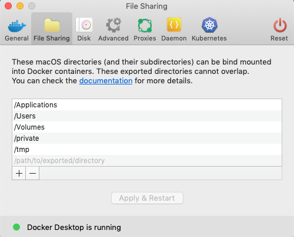
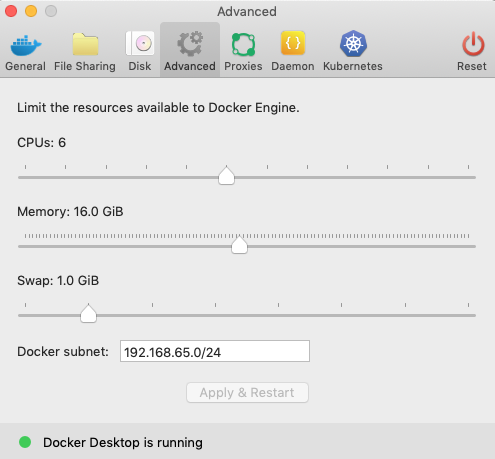
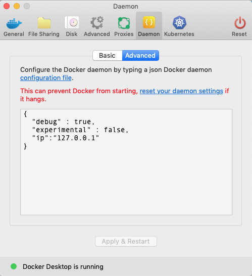

<span style="font-size:3em;">devenv - A development environment for the Mac</span><br/>
Adam L. Lyon (April 2020)

- [0. Changes](#0-changes)
- [1. Introduction](#1-introduction)
- [2. Why Docker containers](#2-why-docker-containers)
- [3. Assumptions](#3-assumptions)
- [4. Details](#4-details)
- [5. Installation](#5-installation)
  - [5.1. Install and prepare Docker for Mac](#51-install-and-prepare-docker-for-mac)
  - [5.2. Prepare NFS on your Mac](#52-prepare-nfs-on-your-mac)
- [6. The docker images](#6-the-docker-images)
- [7. Which image to use](#7-which-image-to-use)
- [8. Running the containers with `docker-compose`](#8-running-the-containers-with-docker-compose)
  - [8.1. Setting up `docker-compose`](#81-setting-up-docker-compose)
  - [8.2. Notes about `docker-compose`](#82-notes-about-docker-compose)
  - [8.3. Features of  `docker-compose.yml` file](#83-features-of-docker-composeyml-file)
- [9. Running](#9-running)
  - [9.1. Run the long lived container as a service](#91-run-the-long-lived-container-as-a-service)
  - [9.2. Some notes](#92-some-notes)
- [10. Doing stuff](#10-doing-stuff)
  - [10.1 Setting up X11](#101-setting-up-x11)
  - [10.2. Examining container resource usage with `netdata`](#102-examining-container-resource-usage-with-netdata)
  - [10.3. Running VSCode](#103-running-vscode)
  - [10.4 Running sshfs](#104-running-sshfs)

# 0. Changes

2020-09-07: This repository has been streamlined by removing the VNC and ephemeral images (the cvmfs server and client) in favor of the simpler images that make long lived containers. References to CLion have been removed as I am no longer using it in favor of Microsoft Visual Studio Code (CLion licensing became unfriendly towards the lab). I have added clang tools to the SL7 image for clang-format and clang-tidy. I have also changed the meaning of `CVMFS_EXP`. It can now hold a colon-separated list of CVMFS volumes to mount (e.g. `larsoft.opensciencegrid.org:larsoft.osgstorage.org`). The full name of the CVMFS volume must now be given, as in the example. I also added packages that Mu2e discovered were needed for art v3_6_2

# 1. Introduction

Linux style development, like what we do for particle physics experiments at Fermilab, is becoming more difficult on the Mac. Apple is moving to its own style of development that is often incompatible. For example,

- System Integrity Protection (SIP) prevents using `DYLD_LIBRARY_PATH`, breaking the mechanism used by our development environment system, `ups`.
- Mac headers and system libraries are not always compatible with those on Linux, necessitating platform dependent code.
- XCode is more focused on Swift, Objective-C, and Mac or iOS-style development. XCode does not understand CMake builds natively.
- This just gets worse as Apple moves away from Intel based hardware platforms.

The differences that Mac and XCode introduce are difficult to manage and many experiments have stopped making Mac builds. Despite these problems, Mac laptops remain powerful machines and the MacOS environment is advantageous in many other areas. Therefore, mitigating the problems with Linux style development is motivated.

This package contains a configuration for `docker` containers along with instructions for integrating with the Mac that make for an effective and efficient development platform for Linux style development of physics code. Instructions for using [Microsost Visual Studio Code](https://code.visualstudio.com) (VSCode) for C++ development in this environment are given in the documentation.  

Note that the containers and techniques here may also work on Windows. You will have to adapt these instructions for that platform.

# 2. Why Docker containers

There are three ways to do Linux style development on the Mac

1. Not do it (resistance is futile) - that is conform to the Mac development style. As discussed above, this solution is becoming too difficult and costly to maintain. The vast majority of scientific code development is targeted at Linux. The more the Mac diverges, the more difficult it is to maintain a pure Mac development environment.
1. Run a Linux virtual machine with [Virtual Box](https://www.virtualbox.org) and [vagrant](https://www.vagrantup.com). A Virtual Box Linux VM is a heavyweight virtualization solution that is complicated to set up and maintain. `vagrant` makes configuration and management easier though not simple. Virtual Box VMs are also difficult to distribute. One advantage here is that many Mac IDEs that support remote development do so with `ssh`, which is the preferred way to interact with a VM.
1. Run a Linux Docker Container. [Docker](https://www.docker.com) containers are lightweight virtualization solutions, relatively easy to set up and configure and are portable to other systems that run Docker or [Singularity](https://sylabs.io). A disadvantage is that running `ssh` in the container is not the "docker way", therefore integration with remote development capable IDEs is more difficult, but not impossible. VSCode has superb integration with Docker containers.

Another aspect is performance. Many of the solutions have overhead that makes builds or development slow. The instructions here aim for the most performant system possible with docker.

# 3. Assumptions

Currently, it is assumed that you are working in Scientific Linux 7 (this is the OS that Muon g-2 and many of the neutrino experiments use) and you are accessing executables and libraries with the [CernVM Filesytem (CVMFS)](https://cernvm.cern.ch/portal/filesystem). CVMFS is an extremely efficient and flexible system for delivering up to date dependencies to your development environment. By caching only the files you actually use, your experiment's dependencies will have the smallest footprint on your system possible. CVMFS allows one docker image to be experiment agnostic and useful for many development projects.

# 4. Details

- For best performance, `/cvmfs` is mounted and managed from within the container (mounting the Mac's CVMFS within the container performs very poorly).
- You will keep your development and code directories and files on your Mac file system. The container will need performant access to that filesystem. We will use `nfs` (transparently to you) to do that.
- You will run the container as a "service". You can have multiple shells connected to the container as well as a connection from an IDE like VSCode.

# 5. Installation

These instructions will guide you through installing the containers and associated files.

## 5.1. Install and prepare Docker for Mac

You need to install and configure `docker` on your Mac. Go to <https://www.docker.com/products/docker-desktop> and click on "Download Desktop for Mac and Windows". Then click on "Download Docker Desktop for Mac". If given a choice, choose the "stable" edition and not "edge". The latter is a preview version and I've found that to be unstable. You can then skip the rest of the tutorial on the web site.

Docker for Mac is a service that runs on your Mac all the time in order to support and run Docker containers. You should see a little "whale" icon in your menu bar. Click on that and select `Preferences`. I leave the main preferences page as the default. Select `File Sharing`. This screen shows what top level directories you want to share with docker containers. If you plan to run VSCode on the Mac as described [here](vscode-docker.md), then you need to add directories to make it look like the following,



If you do not plan to run VSCode, then you can leave the default.

Next, click on the `Advanced` tab. I allow Docker to access half of my Mac laptop's threads (I have 6 CPUs and 12 hyper-threads) and half of the machine's memory (I have 32 GB). See below.



You can tailor these preferences to your liking. Leave the subnet as the default. If you make changes, you must click "Apply & Restart".

Next, click on `Daemon`. By default, docker will allow containers serving network ports to accept incoming connections from outside of your laptop. In general, this is a security problem and could lead to your Mac being blocked on the Fermilab network if the lab security scanner detects an accessible open port into, say, a web service hosted by a container. You can restrict docker to only accept connection from your Mac itself by changing the configuration as shown (in particular, the `ip` setting).



This setting eliminates the possibility of a security problem with docker.

If you've made any changes, click on "Apply & Restart".

Note that you can make your life easier with bash command completion when entering docker commands. See [here](https://docs.docker.com/compose/completion/) for how to install that. Follow the Mac instructions.

## 5.2. Prepare NFS on your Mac

For the best performance, your `/Users` directory will be served by your Mac into the docker container with `nfs`. I have found this technique to be the most performant way to access data on the Mac from the container. It is a little complicated to set up, so we'll do it only for the directory that matters - that is where all your code files exist in `/Users`. To do this, you need to follow these steps from a Mac terminal:

First - determine your user and group id numbers. Record them somewhere.

```bash
id -u  # User ID
id -g  # Group ID
```

Now, edit the `/etc/exports` file with `sudo emacs -nw /etc/exports` from the Mac terminal. You may need to enter your password for the `sudo` to work. Add a line like the following (note that if you've upgraded to MacOS Catalina, you'll need to change to the below and restart `nfsd`)...

 ```bash
/System/Volumes/Data -alldirs -mapall=502:20 -no_subtree_check -async localhost
```

 Be sure to replace the `502` with your user ID and the `20` with your group ID. Note that the `localhost` means your files will not be exported outside of your laptop, so this is safe. Save with `Ctrl-x Ctrl-c`.

 Now, edit `/etc/nfs.conf` with `sudo emacs -nw /etc/nfs.conf`. Add the following line,

 ```bash
nfs.server.mount.require_resv_port = 0
```

and save with `Ctrl-x Ctrl-c`.

This option means (from the man page):

> nfs.server.mount.require_resv_port:
                This option controls whether MOUNT requests are required to
                originate from a reserved port (port < 1024).  The default value
                is 1 (yes).  Many NFS server implementations require this
                because of the false belief that this requirement increases
                security.

Now, restart nfs with

```bash
sudo nfsd restart
```

Finally, restart docker. Click on the whale symbol in the menu bar and select `Restart` from the menu.

You can learn more about this configuration at this [blog post](https://medium.com/@sean.handley/how-to-set-up-docker-for-mac-with-native-nfs-145151458adc).

For Catalina information, including gaining access to your `Documents` directory, if that's necessary. See [here](https://www.firehydrant.io/blog/nfs-with-docker-on-macos-catalina/).

# 6. The docker images

There are five docker images you may pull or build (note that all of the images have `lyonfnal/` in front).

- `devenv:sl6` Scientific Linux 6 base image. Includes SL6 with packages needed for development.
- `devenv:sl7` Scientific Linux 7 base image. Includes SL7 with packages needed for development including `clang` tools.
- `devenv_cvmfs:sl6` and `devenv_cvmfs:sl7` Above as base with CVMFS. Allows one to mount CVMFS. The following CVMFS volumes are mounted,
  - `/cvmfs/config-osg.opensciencegrid.org`
  - `/cvmfs/fermilab.opensciencegrid.org`
  - Directories specified in the environment variable `CVMFS_EXP` as a colon separated list. For example,
    - `CVMFS_EXP=gm2.opensciencegrid.org` will mount `/cvmfs/gm2.opensciencegrid.org`.
    - `CVMFS_EXP=uboone.opensciencegrid.org:uboone.osgstorage.org` will mount `/cvmfs/uboone.opensciencegrid.org` and `/cvmfs/uboone.osgstorage.org`.
  
# 7. Which image to use

The following use cases are instructive for deciding which image to use.

`devenv:sl6` and `devenv:sl7` are pretty useless on their own because they do not have CVMFS. They serve to be a base image for others.

`devenv_cvmfs:sl6` and `devenv_cvmfs:sl7` will be your main workhorse. A container from this image will start CVMFS on launch. Mounting CVMFS can take a minute or two. In practice, you should start this container rarely and `docker exec` into it to gain a shell. You can also use `docker-compose` to make this workflow easier (see below). In this way, this container is running like a service.

# 8. Running the containers with `docker-compose`

To run the containers with `docker run` would require many, many options to the command to set up the container correctly. It is much easier to run the container from [docker-compose](https://docs.docker.com/compose), which stores the configuration in a file. This also makes it much easier to use VSCode.

## 8.1. Setting up `docker-compose`

You are likely wanting to run the container for a development purpose. Make a directory on your Mac for a development area. For example, I may choose `/Users/lyon/Development/gm2/laserCalib`. In that directory, make a `docker` sub-directory.

Now copy the `docker-compose.yml-TEMPLATE` file from this repository. You may either check out the repository or download the file directly from [here](https://github.com/lyon-fnal/devenv/tree/master/compose).

Follow the instructions in the comments at the top of the file and replace the parts of the template.

## 8.2. Notes about `docker-compose`

Docker compose works like `vagrant`. `docker-compose` commands will look in the current directory for the `docker-compose.yml` configuration file.  This can be quite convenient. If you would rather operate out of a different directory, you can always add the `-f FILE` option and give the location of the file. For example,

```bash
docker-compose -f ../docker/docker-compose.yml ...   # if you aren't in the directory with the docker-compose.yml file
```

For the instructions below, we'll assume that you are in the directory with the `docker-compose.yml` file.

Also, you need to be a little careful about where you put options on the command line. In general, the form of a `docker-compose` command is,

```bash
docker-compose <COMMAND> <COMMAND-OPTIONS> <SERVICE> <SERVICE-OPTIONS>
```

For example, this works (and overrides the entrypoint of the container).

```bash
docker-compose run --rm --entrypoint /bin/bash devenv-laserTest "-c runMyScript.sh"
```

The `--rm` and `--entrypoint` options are for the `run` docker-compose command. The `-c runMyScript.sh` option is passed to the container when it launches.  Moving those options around will fail. For example, this will not work...

```bash
docker-compose --rm run  devenv-laserTest --entrypoint /bin/bash "-c runMyScript.sh"  # FAILS because '--rm' needs to go after 'run'
```

## 8.3. Features of  `docker-compose.yml` file

The docker-compose configuration file defines one service that you'll use. `<NAME>` is the name you chose, such as the development area name. We'll show the cases for Scientific Linux 7 (sl7); they'll be the same if you configured for SL6.

- `devenv-<NAME>`: Service makes a long lived container from the `lyonfnal/devenv_cvmfs:sl7` image that mounts CVMFS at launch.

You can alter the `docker-compose.yml` file to add additional services, such as for different experiments.

# 9. Running

Below are instructions for running the services in the `docker-compose.yml` file.

NOTE: The first time you try to run, you may encounter errors complaining that volumes do not exist. These errors are true - follow the instructions provided in the error message for creating the volumes. This may happen more than once - do it for each missing volume to create them all. Once you do this, you do not need to do it again.  

## 9.1. Run the long lived container as a service

The long lived services mount CVMFS and then wait to be killed. You will "exec" into the container to do work ("exec" will launch a command like `bash` in an already running container). In general, you start the service with

```bash
docker-compose up -d <SERVICE>
```

where `<SERVICE>` is the service you want to start. If you leave that off, all of the services in the file will be started, and you likely don't want that.

Here's an example,

```bash
docker-compose up -d devenv-test
```

Many of the services take awhile to start. You can look at progress with

```bash
docker-compose logs -f <SERVICE>
```

Type Ctrl-C to exit out of the log viewer. The service will continue run.

To stop all services, do

```bash
docker-compose down
```

To get a bash shell prompt from an "up" service, use `docker-compose exec`. For example,

```bash
docker-compose exec <SERVICE> /bin/bash
```

Exiting from that shell does **NOT** stop the service. You can `docker-compose exec` again.

To start a service to the prompt **without** initializing (e.g. not start CVMFS; this is not typical and is used to debug the image),

```bash
docker-compose run --rm --entrypoint /bin/bash <SERVICE>  # Not typical to run this way
```

The startup script will not run, and so CVMFS will not be mounted.

## 9.2. Some notes

This `docker-compose` configuration template is not really set up to run containers from different development areas simultaneously. If you try this, you may need to change the host port numbers or use ephemeral ports to avoid conflicts. You can certainly change the compose file to suit your needs (e.g. remove services you'll never use).

You may want to have one `docker-compose.yml` file for your entire development setup (e.g. not make one per development area). That would allow you to run more containers simultaneously with changes to the file. Furthermore, all containers defined by one `docker-compose.yml` file are on the same "docker network".

# 10. Doing stuff

The container should have the tools you need to do what you want. You can set up `mrb`, run `art` code, run `root`, etc. You can install linux software on your Mac volume and run it from the container. If there's a basic tool or program you want included in the container, make a pull request to the Github repository.

## 10.1 Setting up X11

If you want to run `root` or other X11 based programs and have the displays show up on your Mac, you need to do the following.

- Start XQuartz
- In XQuartz's preferences under the Security tab, turn on "Allow connections from network clients" (you only need to do this step once)
- In a terminal on your Mac, do `xhost +127.0.0.1` You will need to do this command ever time your Mac reboots
- Note that X11 will be rather slow

## 10.2. Examining container resource usage with `netdata`

The `netdata` server program is included in the image. You can run it in a long lived container by typing `netdata` at a shell prompt within the container. There will be no response. You may then use your Mac web browser (e.g. Safari) and go to `localhost:19998`. You can then explore nearly endless aspects of what the container is doing.

## 10.3. Running VSCode

See [vscode-docker.md](vscode-docker.md) for running VSCode on your host computer and connecting to a SL7 container.

## 10.4 Running sshfs

You may need access to data on a Fermilab computer, say in `/pnfs`. If you can log into a Fermilab `GPVM` node, then you can mount any directory on that node into your container with `sshfs` with these commands using `/pnfs` for an example. I have found that the connection will get dropped, so to mitigate that note the `reconnect` option, which means that the client will ping the server every 5 seconds and will reconnect after two failures (10 seconds).

```bash
mkdir /pnfs
kinit you@FNAL.GOV  # Get a kerberos ticket with your username
sshfs -o reconnect,ServerAliveInterval=5,ServerAliveCountMax=2 you@gm2gpvm04.fnal.gov:/pnfs /pnfs   # Replace you and the machine with the one you use
ls /pnfs
```
