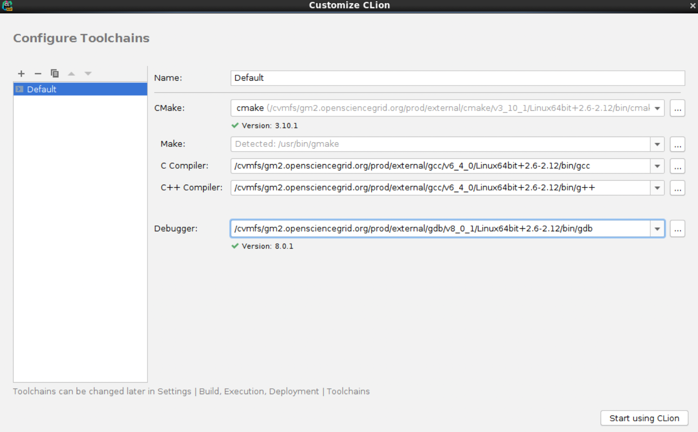
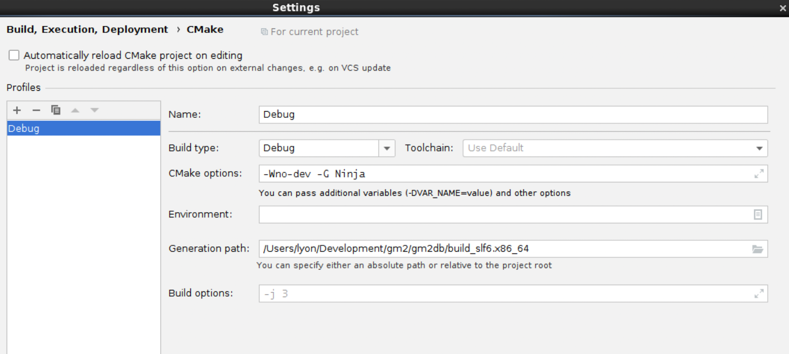

<span style="font-size:3em;">CLion for Linux and the `devenv` containers</span>

Adam Lyon (October 2019)

- [1. Introduction](#1-introduction)
- [2. Linux CLion within the container and VNC](#2-linux-clion-within-the-container-and-vnc)
- [3. Installing Linux CLion](#3-installing-linux-clion)
- [4. Preparing to run and configuring](#4-preparing-to-run-and-configuring)
- [5. Opening a project in Linux CLion](#5-opening-a-project-in-linux-clion)
- [6. Building with Linux CLion](#6-building-with-linux-clion)
- [7. Debugging](#7-debugging)
- [8. Summary for Linux CLion](#8-summary-for-linux-clion)
  
# 1. Introduction

[CLion](https://www.jetbrains.com/clion/) is an excellent C++ Integrated Development Environment from [JetBrains](https://www.jetbrains.com). I find it indispensable for coding in C++. You can easily run CLion within the container with VNC, and instructions here will guide you through setting that up. However, you may be disappointed if you are used to the Mac experience (exceptionally clear fonts, Mac key shortcuts, full screen, etc). This document will guide you through a rather lengthy but working process to use CLion on the Mac to develop within the `devenv` Linux container. 

See [features of CLion](https://www.jetbrains.com/clion/features/) and various demo videos there to learn all the things that CLion can do. Also, the CLion [learning center](https://www.jetbrains.com/clion/learning-center/) is particularly useful as is the [Can you make me more productive with a C++ IDE](https://www.youtube.com/watch?v=Bt0sZNhXW7k) video (note: it starts with annoying loud music). The things I find so useful are code navigation, code analysis, code completion, understanding new C++ standards, refactoring tools, test runners, and debugging. Furthermore, CLion has the best `git` integration that I have seen in any application. It understands when you have several git repositories cloned (as we often do in `art/mrb` style development) and can offer to synchronize feature branches across some or all of the repositories. I can check in and push to multiple repositories in one step. Its merge system is also easy to understand and execute. And if that weren't enough, it includes a full database viewer and has plugins for other languages and tools. It's a remarkable system. 

The problem with CLion is that it is not free. If you are at a university, you can obtain a free license for CLion and other JetBrains products (see [here](https://www.jetbrains.com/student/) - this is especially easy if you have a `.edu` e-mail address). We used to get free licenses at Fermilab, but JetBrains has stopped that practice, which is a huge shame. A lot of the time, however, JetBrains has "Early Access Program" (EAP) versions of CLion and those are free to run. They will, however, eventually expire. And though I run the EAP versions, sometimes new versions have shocking bugs or omissions that make me question their testing process. That said, they are very responsive to bug reports and new EAP versions come quickly that fix glaring problems. The production releases are quite robust and stable, but those require a license beyond a 30 day trial.  If there is enough interest in CLion from lab folks, we may be willing to contact JetBrains again and negotiate a lab license. If you have an affiliation with a university and have a `.edu` e-mail address, then you may use that to get an academic license as mentioned earlier. 

# 2. Linux CLion within the container and VNC

If you are willing to live with a non-Mac experience, you can pretty easily run CLion from within the container. If you are new to CLion and just want to try it out, this will be an easy way to get started, gain some experience, and then decide if you want to continue with the work of running the Mac CLion. Just keep in mind that the Linux experience will be somewhat disappointing if you are used to the Mac. 

Follow the instructions in [README](README.md) and make a `devenv` image that includes `VNC`. Set up a development area and the `docker-compose.yml` file. Run the container as a service and connect to it with VNC.

# 3. Installing Linux CLion
Now, on your Mac, download the **Linux** CLion from [here](https://www.jetbrains.com/clion/download/other.html) and choose the version for Linux with bundled `JBR 8` as a `tar.gz` file. Alternatively, you can install the EAP version from [here](https://www.jetbrains.com/clion/nextversion/). It will default to the Mac `.dmg`, but you can override that by clicking on *DMG* and choosing "Linux with bundled JBR 8 (.tar.gz)". The `JBR 8` is the version of the Java runtime that CLion will use (the GUI is written in Java). The container does not have Java installed and the Java available from `yum` does not work with CLion. With the bundled version, CLion will come with the compatible Java runtime. Note that `JBR 8` is an older version of Java and some special features of the EAP will not work (such as Markdown Preview). I have a work around if you need this feature. Note that Mac CLion has no such issues. 

Once the `tar.gz` file has downloaded, move it to a place accessible from the container (e.g. I use `/Users/lyon/Development/CLion`) and untar the file there. 

# 4. Preparing to run and configuring
Now, go into the container with VNC. Open a terminal window. Set up your environment to the point where you can do a build. For example, source your experiment's setup script and then any other scripts to prepare for a build. For Muon g-2, this could be,

```bash
source /cvmfs/gm2.opensciencegrid.org/prod/g-2/setup
cd /Users/lyon/Development/gm2/laserCalibDB
source localProducts_gm2_v9_18_00_prof/setup
source mrb setEnv  # or . mrb s
``` 

If you are starting a new project, create the development area (including making a `docker-compose.yml` file that runs VNC), and clone the necessary repositories. Do the setup necessary, like the above, to enable a build.   

Now, run CLion with `/path/to/CLion/bin/clion.sh` where the path is the directory that you untarred from the installation. If this is the first time starting CLion, you will be guided through some configuration options. Because `/root` in the container belongs to an external volume, these settings will be retained between runs of the container. When asked to configure toolchains, you should do the following:

* You cannot accept the default values, despite CLion knowing that the C and C++ compilers come from CVMFS. This is because CLion will assume the binary names are `cc` and `c++`. Unfortunately, `cetbuildtools` **insists** on `gcc` and `g++` and will fail if that is not the case. 
* For `CMake`, click on "..." and navigate to the cmake executable in `/cvmfs` that you use. 
* Do the same for C Compiler and C++ Compiler, being sure to chose `gcc` and `g++` respectively. 
* Do the same for `gdb`

My screen looks like the following:


Click on "Start using CLion".

# 5. Opening a project in Linux CLion

If you have used Linux CLion previously, the most recent project will be opened. You can close it with `File -> Close Project` menu option. 

Click on `Open` (the other options will create a new mostly empty `CMakeLists.txt` file, which is typically not what you want to do). Navigate to the `srcs` directory of your development area and open it. 

You may see a warning message "External file changes sync may be slow". This seems to happen when your development area is in the nfs served `/Users` area. I have found no slow down when using `nfs`. You can dismiss the warning. 

The first time you open the project, CLion will try to run CMake in an incorrect build directory and will fail. This is ok and we'll fix it in a moment. 

You may notice that the name of your project is `srcs` (e.g. from the title of the main CLion window). That is because CLion simply uses the directory name for the project name. You can change that to a more useful name, though strangely, there is no way to do this from within CLion itself. Instead, from a shell prompt, do

```bash
cd /path/to/dev_area/srcs
echo 'Project name' > .idea/.name
```
where `Project name` is the name you want for the project. The next time you start CLion, it will use that name for the project.

Now, let's fix the CMake problem. You should see a `CMake` window with the failure. To the left of that window are some icons. Click on the Settings icon (the gear wheel) and select "CMake settings". Change the "Generation path" to the build directory for your development area (e.g. for me it may be `/path/to/dev_area/build_slf6.x86_64`). 

If you want to use `make` for builds, you can just press "OK" in the dialog window. Note that as of CLion 2019.3 EAP, you can now compile with `Ninja` (this is a **major** improvement)! You must use a version of CMake that is at or greater than v3.15. As of writing this file, SciSoft does not have such a version, but you can use the version bundled with CMake. Adjust the toolchain settings to use it (make sure the other settings are the same). Then back to the CMake settings, in the `CMake Options` bar, add `-Wno-dev -G Ninja`. Note that when CMake runs, you may see some benign warnings from this late CMake version. For the configuration, look at the figure below for comparison. 



You should remember that for art-based code, `ninja` is not as robust as `make` in determining all dependencies. In particular, it may not notice when a Root dictionary file needs to be re-generated. If you run and get a Segfault, the first thing to try is to zap your build area (`mrb zap`) and make a fresh build. 

Once you do the above, `CMake` will run and should complete successfully. If it doesn't, you may need to click on the setting wheel again and choose "Reset Cache and Reload Project".

CLion will have created a directory `srcs/cmake-build-debug` from the failed build. You may delete this directory.

Once CMake completes, CLion will use poll the CMake setup to discover all of the include paths and will index everything in your code for navigation. You can Control-click on an include file or an object and navigate to that source. It may take CLion quite a while to create the index (especially if your cvmfs cache is empty) and you may need to be patient.

Note that I typically do Debug builds when I'm developing and testing, and that's most of the time. Debug is the default configuration and so that just works. You can do a "Profile" build as well and you'll need to setup CLion for that. Go into the CMake settings. Unfortunately, "Profile" is not a standard CMake build configuration. Use the "Default" configuration and to the CMake options, add `-DCMAKE_BUILD_TYPE=Profile`. That should re-run CMake. You will then need to rebuild your code. Remove this option and change the build type back to "Debug" to go back to that build type.    

# 6. Building with Linux CLion

In the upper toolbar, you should see the Run/Build configuration box. See the figure with the button explanations. 


 
 It will likely choose a random CMake target (or maybe a test target). The word after the vertical pipe will be the build type (Debug or Default).  Typically, you want to build all targets, which is not one of the choices (unlike in the figure). Apparently, building all targets is not a normal thing to do with CMake. We need to add it.  You can set that up with the following steps...
 
1. Click on the Run/Build Config box and select "Edit Configurations..." . Note that if CLion is indexing your code, you may not see this option. You'l have to wait for the indexing to complete. 
1. In the new dialog box, click on the + in the upper left hand corner and choose "CMake Application"
1. For Target, choose "All targets" (it should be somewhere in the drop down list). 
1. Set the Name to "All" or something like that
1. You can click OK, or continue with this dialog box and set up to run a FCL file

Optional - set up to run a FCL file:
1. For "Executable", click on the text bar and do "Select other..." and navigate within CVMFS to your experiment's art executable (e.g. for Muon g-2 it would be `gm2` within the `art` directory in `/cvmfs`)
1. For "Program arguments" add the `-c FCL_FILE` and other options
1. For "Working directory" choose the appropriate directory.  Note that in the directory chooser dialog box, one of the buttons will conveniently take you to your project directory.
1. Click OK

You may now build, run, and debug the program. 

# 7. Debugging

Debugging should work as expected. One complication is that STL variables (vectors, strings, etc) will not print in a nice way. Turning on the pretty printers requires running a different (and much newer) version of python. The docker image has such a version, but it is difficult to set up and use. Ask me if you really want to try it. 

Running CLion on the Mac and debugging *will* have the pretty printers.

# 8. Summary for Linux CLion

Using CLion on Linux with VNC is quite convenient and is an easy way to get started with CLion without a lot of up front effort. As mentioned, it doesn't look nor act like a Mac application. If that's disappointing to you, then see [clion-mac.md](clion-mac.md) for running CLion on the Mac. 


