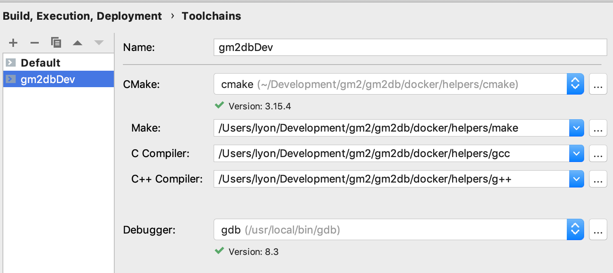
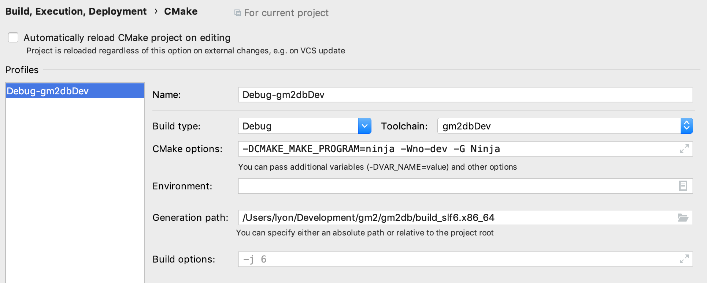
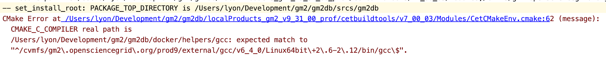
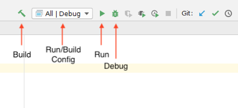

# CLion for the Mac and the `devenv` containers

Adam Lyon (October 2019)
## Introduction

See the introduction in [CLion for Linux](clion-linux.md).

If you have not tried CLion before, you may want to start with [CLion for Linux](clion-linux.md) as configuring it is much easier than CLion for Mac. If you decide you like it, then come back here and do the instructions. If you do this, you should remove the CLion project files so that CLion for Mac won't get confused. You can do that with `rm -rf /path/to/devArea/srcs/.idea`. 

This document will guide you through using CLion on your Mac for building, running and debugging a Fermilab physics experiment Linux application in a docker container. Unfortunately, CLion cannot deal directly with docker containers. It does have a *Remote Development* facility, but it works via `ssh` and wants to copy files locally. The `devenv` docker containers use your source code and build areas on your Mac filesystem, needing no copies. 

The advantages of running CLion for the Mac are clear when you start it. The fonts are exceptionally clear, the keyboard shortcuts are familiar, and some things even work better like debugging. 

## Preparing your Mac

There are a couple of things you need to do on your Mac to make this system work. 

First, set up the `devenv` containers as per the [README.md](README.md) file. 

### Install CVMFS
Then, you must install CVMFS on your Mac and configure it to mount the same CVMFS repositories that you use in the `devenv` container. You must do this so CLion can find headers and source code in `/cvmfs`. Unfortunately, despite haivng a `cvmfs_nfs_server` container that can serve CVMFS via NFS, there seems to be no way to export that to the host Mac. There are two main reasons for this deficiency,

* Docker for Mac does not expose the docker network to the Mac host. This is because docker actually runs a virtual machine behind the scenes and the Mac has no easy access to that.
* You can forward one or more ports to the Mac host, but NFSv3 uses many ports that will conflict with NFS running on your Mac (in order to serve your `/Users` area to the container). NFSv4 offers mounting nfs volumes with only one port, and that would be ideal and even usable, but CVMFS does not seem to work with NFSv4. 

Because we are going to use CVMFS only for headers and some source code, the amount of data you'll cache from CVMFS on your Mac will be small.

See [here](https://cdcvs.fnal.gov/redmine/projects/novaart/wiki/Setting_up_NOvA_Software_on_your_Laptop) for an example of setting up CVMFS on your Mac. 

### Perhaps install a late version  Linux CMake
If you want to do builds with `ninja` (yes, you do) instead of `make`, then you'll need a late version of CMake. To do builds with ninja, CLion requires CMake v3.15 or later - that's likely much later than what you use in your release and what is on SciSoft. Choose an area on your Mac (I do `/Users/lyon/Development/CMake`) and [download](https://cmake.org/download/) the **linux** (not Mac) CMake `.tar.gz` file (I did v3.15.4). `tar xf` the tar file to unwind it. 

## Installing CLion

 Install CLion for the Mac from [here](https://www.jetbrains.com/clion/download/#section=mac) or [here](https://www.jetbrains.com/clion/nextversion/) for EAP builds (early access program). I generally install the EAP because they have new features that I want, though they sometimes have problems. 
 
## Cloning this repository

We will be using some scripts in the `helpers` directory of this Github repository. You should `git clone` the repository to somewhere accessible from the container (e.g. under `/Users/<USER>/...`). 
 
## Preparing your development area and `docker-compose`

We want to be able to run commands in the container quickly with a minimum of startup time. We can do two things to make that happen...

* Incur the CVMFS mount time once and not per each command. We'll `docker-compose exec` into a container that already has CVMFS running. 
* We'll store the development environment (environment variables) and use `docker-compose` to quickly reinstate it when we run a command in the container with `docker-compose exec`.    

### Capture your development environment to an `.env` file
 
 Prepare the `docker-compose.yml` file as per [README.md](README.md) and start the long lived `devenv-<NAME>` service (where `<NAME>` is the descriptive name you gave to identify the containers/service). For example `docker-compose up -d devenv-<NAME>`. Now, `docker-compose exec devenv-<NAME> /bin/bash` to start a shell in the container. Set up your development area and checkout source code. 
 
 If you use the `art` framework, you must make your own local release of `cetbuildtools`. That is because the `cetbuildtools` CMake macros perform a check that our scripts will violate. With your own version of `cetbuildtools`, you can circumvent the check. To get your own `cetbuildtools`, look at the version of cetbuildtools that you use (e.g. setup your environment to the point where you can do a build and look at `$CETBUILDTOOLS_DIR` and note the version). With your Mac web browser, go to https://scisoft.fnal.gov/scisoft/packages/cetbuildtools and find that version. Download the `cetbuildtools-XX-noarch.tar.bz2` to your `localProducts...` directory with `wget` and unwind with `tar xf <.tar.bz2> file`. Now do your build environment setup again (e.g. `. mrb s`).  Do `ups active` to ensure that `cetbuildtools` comes from your local products area. You can remove the tar file now. 
 
 You should also `setup gdb` and any other packages that aren't yet set up (rare).
 
 NOTE: If you downloaded a late version of `cmake`, then you need to fix your environment to use it...
```shell script
# To use late version of CMake
unsetup cmake  # Do not use the UPS version
export PATH=/path/to/CMake/directory/bin:$PATH  # Be sure first item ends in bin, not cmake
```
 
 Let's capture your enviornment to a file. Still in the container, `cd` to your docker directory for this development area (where your `docker-compose.yml` file is located). Run a script from the devenv repository helpers directory...
 
 ```shell script
/path/to/devenv/helpers/make_env.sh > <ENV_NAME>.env
 ```

where `<ENV_NAME>` is some descriptive name that describes the environment like `build`. Or it can be the same as `<NAME>` you've used elsewhere.  

If you look at that file, you'll see it contains all (nearly all) of the environment variables you have set. We can restore this environment using `docker-compose` for very fast start up.

IMPORTANT: Now, exit from the shell and bring down the container with `docker-compose down`.

### Changes to `docker-compose.yml`

Now, on the Mac with an editor, edit the `docker-compose.yml` for your development area. First, uncomment the two lines under `x-env-file: &default-env-file` to read,

```
x-env-file: &default-env-file
  env_file
    - ./<ENV_NAME>.env
```

Wheere `<ENV_NAME>` is the name you chose earlier.

Now, also uncomment the two lines each under `x-volumes1` and `x-volumes2` involving mounting `/private` and `/Applications` (so uncomment four lines total). The docker container will need access to those areas.

Now, uncomment the last line of the block with `x-worker`. That is,
```
  <<: *default-environment   # I uncommented
``` 
 
 Start up the container again with 
 ```shell script
docker-compose up -d devenv-<NAME>
 ```
and wait for CVMFS to start up (`docker-compose logs -f devenv-<NAME>`).

For fun, `docker-compose exec` into a shell (see above). You'll see that your development environment is magically set up already! No need to source any scripts! This happens because we are passing in the list of environment variables and they are being set before you get the shell prompt. You can verify with `ups active`. Do `cmake --version` to make sure you have the correct `cmake`. Note that shell functions are **not** passed into the environment. That means that the UPS `setup` function (yes, it's a bash function, not a script) will not work. 
 If you need `setup` and/or `unsetup` restored, you can, within the container, `source /path/to/devenv/helpers/restore_ups_setup`. If you need an extra package for builds and such, then set it up, check `ups active` and redo the `make_env.sh` step above. Then exit the shell and restart the container. 

## Creating the helper scripts

Our strategy will be to create a toolchain for `cmake` and  compilers that will call our helper scripts that, in turn, will run the corresponding program in the container. CLion cannot do this for docker containers out of the box (a different JetBrains product, `PyCharm`, can for Python - maybe CLion will add this functionality one day). Since CMake will be calling these helper scripts, we are not able to add extra logic or arguments (e.g. we cannot write one helper script to rule them all). 

To make the helper scripts, see and follow the instructions in `/path/to/devenv/helpers/runWithDockerExec-TEMPLATE`. 

You will end up with six files in the `helpers` directory; five of which are symbolic links. 
```shell script
cmake -> runWithDockerExec
g++ -> runWithDockerExec
gcc -> runWithDockerExec
make -> runWithDockerExec
<EXP> -> runWithDockerExec  # Where <EXP> is experiment's art program like gm2 or nova
runWithDockerExec
```

We will use the `cmake`, `g++`, and `gcc` soft links for running those commands in the container. You should try to run them and make sure they work and you get the correct versions. (the container must be running).
```shell script
./cmake --version  # An error about lack of CMAKE_ROOT may be ignored
./g++ --version
./gcc --version
./<EXP> --version
```

## Running CLion

Be sure your `devenv-<NAME>` container is up and running with CVMFS mounted. 

Start the CLion Mac application. If this is the first time you are running CLion, you will need to do some configuration. Just follow all the steps. When it asks you for a toolchain, leave the defaults as they are and continue. 

### Open the project

If you've used CLion before, it will open the previously used project. If that's not what you want, select the menu option `File -> Close Project`.

To open a project, click on `Open` (the other options will make a new empty `CMakeLists.txt` file and that's typically not what you want to do) and navigate to the directory on your Mac that contains the top level `CMakeLists.txt` file (typically `/path/to/your/dev/area/srcs`). 

The first time you open the project, `cmake` will start running and it will fail. We'll fix that in a moment. 

You may notice that the name of your project is `srcs` (e.g. from the title of the main CLion window). That is because CLion simply uses the directory name for the project name. You can change that to a more useful name, though strangely, there is no way to do this from within CLion itself. Instead, from a shell prompt, do

```bash
cd /path/to/dev_area/srcs
echo '<Project name>' > .idea/.name
```
where `<Project name>` is the name you want for the project. The next time you start CLion, it will use that name for the project.

Now, let's fix the CMake problem. You should see a `CMake` window with the failure. To the left of that window are some icons. Click on the Settings icon (the gear wheel) and select "CMake settings". Change the "Generation path" to the build directory for your development area (e.g. for me it may be `/path/to/dev_area/build_slf6.x86_64`). 

Now, select `Toolchains` on the left. This will bring up the toolchains pane. Click on the "+" to make a new Toolchain. Select `System` (**not** Remote) and give it a name like your development area or `<NAME>` that you've used elsewhere. Now, click on the three dot buttons and select the helper sym-links. Note that when you select a sym-link, CLion will unhelpfully resolve it and replace it with the target script. That's not what you want. Edit the path in the text bar and restore the sym-link name. Once you do one setting, you can copy, paste, and modify for the others. Do not press "enter" or "return" on this dialog box, as that will close the box. See the figure below. Note that I have a Homebrew version of gdb. 



CLion will run some tests and give you the versions of CMake and gdb. Be sure these are correct (especially CMake). 

Now, to back to the CMake settings (`CMake` on the left toolbar under Toolchains). Select the new toolchain you just made. Be sure the Generation Path is correct (you set that before) and, assuming you want to run `ninja` (yes, you do), add the following to `CMake options`:
```
-DCMAKE_MAKE_PROGRAM=ninja -Wno-dev -G Ninja
```
The `-Wno-dev` turns off some (but not all) warnings that the later versions of CMake spit out. Your window should look like the following picture.



Click on "OK". CMake should start to run, but it won't get far. You should see an error like the below,



This is `cetbuildtools` checking the path of gcc and failing when it isn't what it expects. We need to remove this failure mode. Click on the highlighted file in the error to bring it up in the editor. See the figure.  


Highlight the `if` block as indicated and simply delete it. 

Now run CMake again (click on the circular arrows in the CMake window). An error for g++ will occur. Fix it the same way as before and run CMake again.

And now CMake should run to completion! You may see some warnings and you may ignore then. 

After CMake finishes, CLion will gather symbol information and index the code (you'll see an indication of this in the status bar at the bottom of the CLion window). This may take a long time and some functionality is limited while this is happening. It only takes a long time the first time it indexes. 

### Building with Mac CLion

In the upper toolbar, you should see the Run/Build configuration box. See the figure with the button explanations. 


 
 It will likely choose a random CMake target (or maybe a test target). The word after the vertical pipe will be the build type (Debug or Default) along with the toolchain name (not shown in this page). Typically, you want to build all targets, which is not one of the choices (unlike in the figure). Apparently, building all targets is not a normal thing to do with CMake. We need to add it.  You can set that up with the following steps...
 
1. Click on the Run/Build Config box and select "Edit Configurations..." . Note that if CLion is indexing your code, you may not see this option. You'l have to wait for the indexing to complete. 
1. In the new dialog box, click on the + in the upper left hand corner and choose "CMake Application"
1. For Target, choose "All targets" (it should be somewhere in the drop down list). 
1. Set the Name to "All" or something like that
1. You can click OK, or continue with this dialog box and set up to run a FCL file

Optional - set up to run a FCL file:
1. For "Executable", click on the text bar and do "Select other..." and navigate to your <EXP> helper script in your helpers directory. 
1. For "Program arguments" add the `-c FCL_FILE` and other options
1. For "Working directory" choose the appropriate directory.  Note that in the directory chooser dialog box, one of the buttons will conveniently take you to your project directory.
1. Click OK

You may now build, run, and debug the program (see below for how to debug). 

### Debugging

To do debugging, we'll set up a remote `gdbserver` in the container and then talk to it with `gdb` from the Mac. 

CLion comes with its own `gdb`, but I find that it does not work in that it cannot determine variable values. That's a big limitation. The `gdb` out of Homebrew works just fine. To install it on your Mac, assuming you have [Homebrew](https://brew.sh), do
```shell script
brew install gdb --with-all-targets
```
See [here](http://tomszilagyi.github.io/2018/03/Remote-gdb-with-stl-pp) for more information. 

Now we need to make a new remote debug configuration. From the Run/Build Configuration box and choose "Edit Configurations". Press the "+" and select "GDB Remote Debug". Give the configuration a name. If you have the Homebrew `gdb` selected in the tool chain, select that gdb executable. For "target remote args" do 
```shell script
localhost:7777
```
The `docker-compose.yml` file says to publish port 7777 from the container to the Mac host. 

That's all you need to fill out; click OK.

To start debugging, open a bash shell in the container (`docker-container exec devenv-<NAME> /bin/bash`) and `cd` to the right place. Then run `gdbserver` with,
```shell script
gdbserver :7777 <EXP> -c <FCL FILE> ...
```
Where `<EXP>` is your experiment art executable (`nova`, `gm2`, etc) followed by arguments. That will start the `gdbserver` and will wait for a connection.

Back in CLion, select the GDB Remote Debug configuration in the Run/Build box and click on the "bug" symbol to debug. In the new debug pane, click on "Debugger" and then "GDB" and watch the start up. If you are populating CVMFS, which you may be if you are debugging for the first time, then `gdb` may timeout and the `gdbserver` will quit. Try the process again and it should work. 

You should be able to do a full debug with all the features as if you are local. 

There are ways to use CLion to start the `gdbserver`, but that's beyond the scope of this document. 

## Appendix

### How the CMake in docker setup works

Some random notes on how this system works and why some choices were made so I don't forget.

The goal here is to allow **performant** and, at a slightly less priority, convenient use of CLion on the Mac for Linux development. Performance is the key. CLion has a remote development mode, but is uses `ssh` and it seems to call it many, many times to get into the remote side for many tasks. CLion also wants to copy files between the remote and local sides. The fact that our development environment requires substantial initialization means that each `ssh` call incurs substantial overhead along with file movement. Performance suffers to the point that the system is unusable. 

To mitigate these problems, the system here,
* Uses docker for very performant linux access
* Docker accesses the local filesystem in a performant way (nfs).
* The "local" and "remote" paths are the same, so no file movement is necessary
* docker-compose can apply an environment to a container quickly, so overhead is very low
* Mounting CVMFS, which can take a long time, can be done once for the container.

---

CLion asks for the location of `cmake`, `make`, the C and C++ compilers, and `gdb` in the Toolchain preference pane. To make these applications run within a docker container, we need a helper script that go into the container with the correct environment at the correct directory and run the program with the correct arguments. Since the `docker` call is the same for all of these programs, there is a script `runWithDockerExec` that does that work. It would be nice to have this one script and somehow pass in the program to run, but this needs to look like the programs themselves (from the Mac CLion point of view). So the way this works is that you copy this script to your working area, make some changes to bake in the location of the docker-compose.yml file and the service to talk do, and then make soft links to this script with the names of the needed programs (`cmake`, etc). The script can figure out the name of the program from `$0`.

The locations of these soft links must then be filled into the toolchain pane. Despite `cmake` doing nearly all of the work of setting up the project, CLion goes in after `cmake` runs and determines dependencies by running the compiler directly on particular files. For some reason, it gets the location of the compiler from `cmake`, not the entries in the toolchain. I think this is the only time when CLion actually directly runs the compilers (not for building, since it just calls `cmake --build`).  Therefore, the compiler path that `cmake` knows must point to an application that the **Mac** can run. That is, you can't play a trick of overriding the compiler paths in cmake options to their linux paths (if you could do this, then you would not need to remove the compiler path check in `cetbuildtools`). The compiler paths must be to the helper soft links. The `runWithDockerExec` must be smart to know that if it is called from the Mac, it runs in the container. If it is called from Linux, then it just runs the program directly. 

Just to make this clear...
1. The compiler paths in the toolchain must point to the helper symlinks
1. CLion calls `cmake` (the helper sym-link) with command line options to set  `-DCMAKE_C_COMPILER` and `-DCMAKE_CXX_COMPILER` to the paths in the toolchain. 
1. cmake on linux uses those compiler paths to prepare the project.
1. Once cmake is done, CLion on the Mac calls the compilers directly to determine dependencies. It does not get the paths to the compilers from the toolchain, but rather from `cmake` itself. Therefore, those paths that were passed into cmake must point to scripts that the Mac can run as well as Linux.


`
